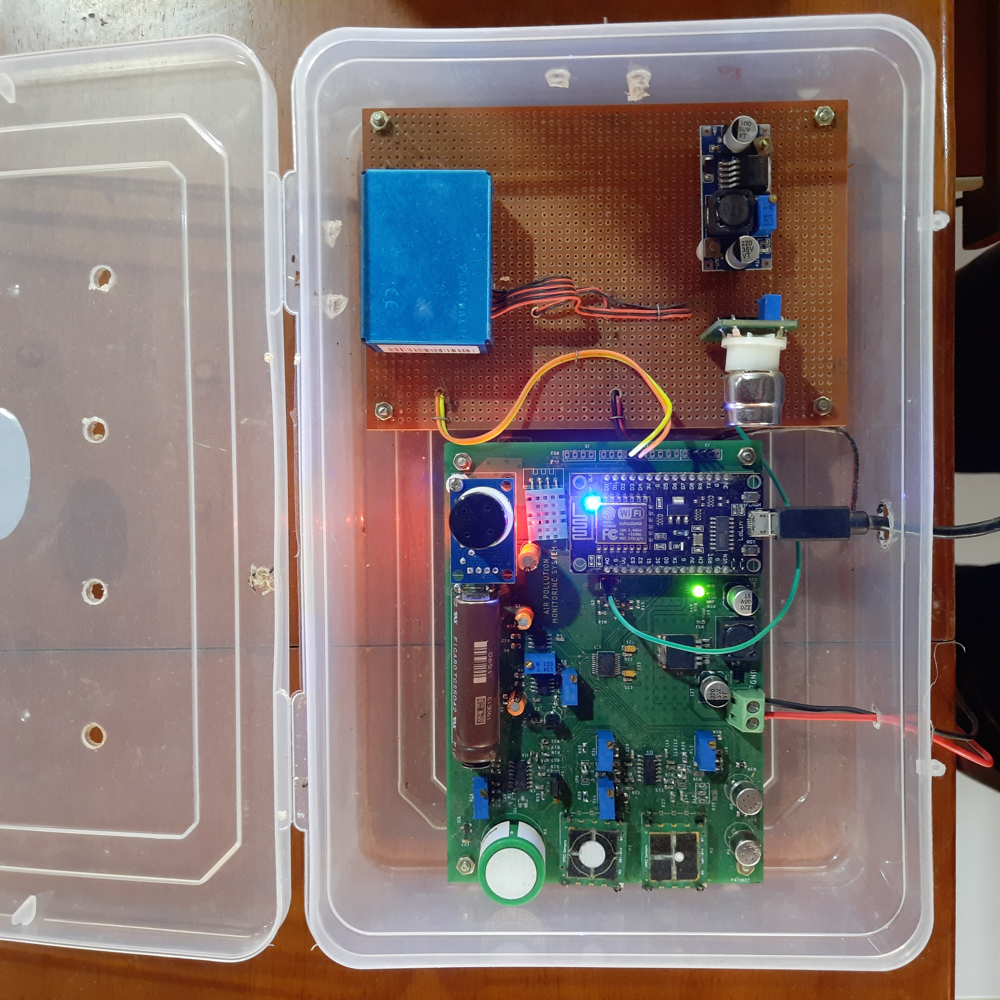
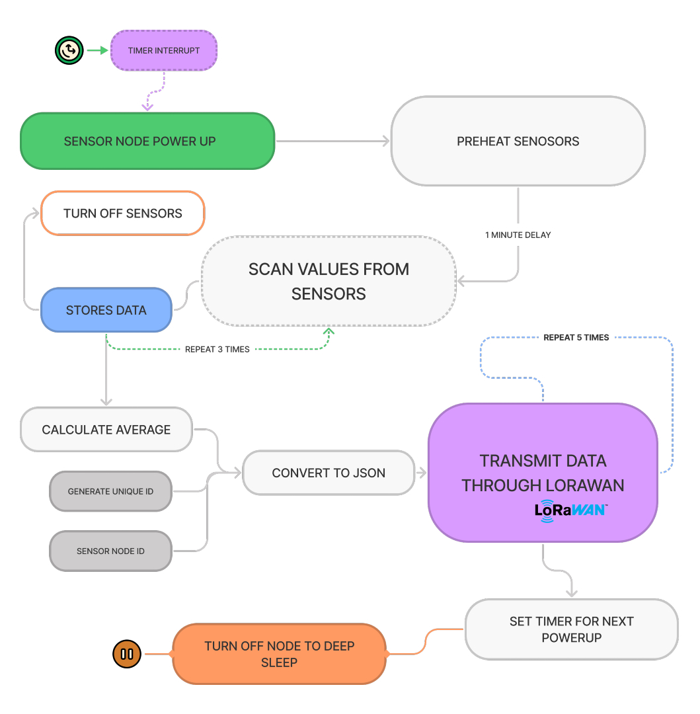
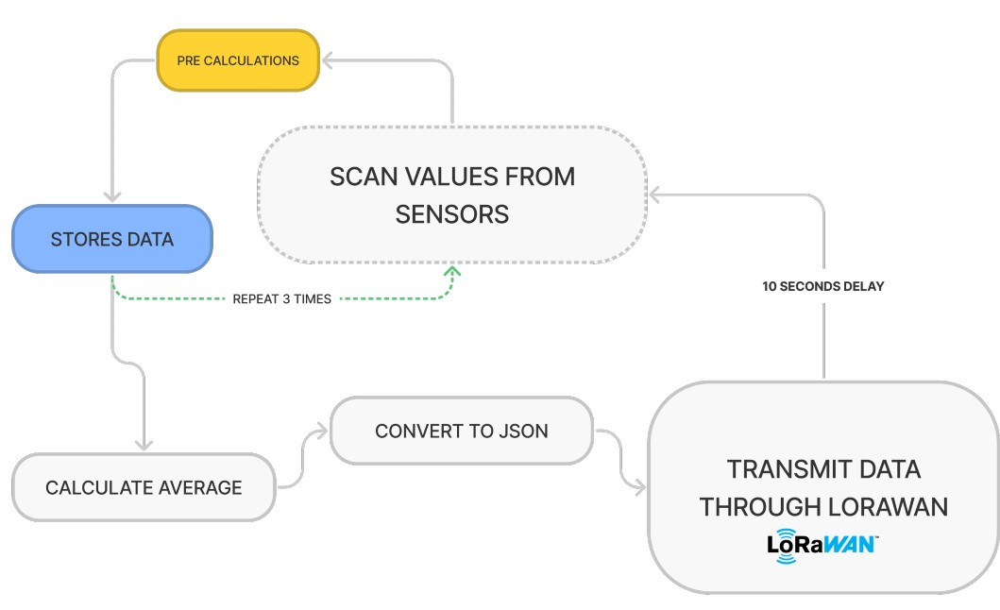
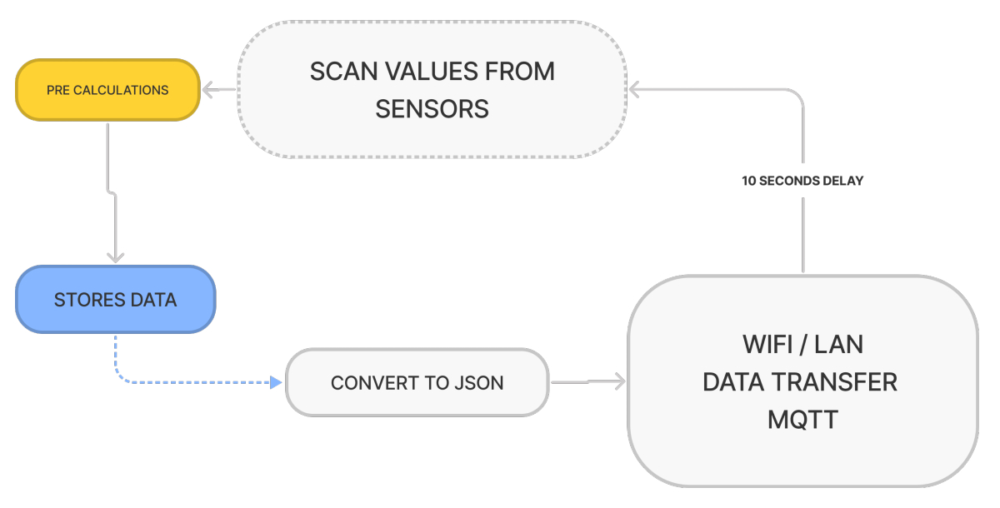

# POLMO - Hardware


## Contents

- [View Code](#code)
- [Hardware Photo](#hardware-photo)
- [Designs of Multiple node](#designs-of-multiple-node)
    - [Polmo Rural node](polmo-rural-node)
    - [Urban Polmo node]()
    - [Indoor Closed Network Polmo node]()


## Code

Node Mcu (ESP8266 1.0) code can be viewed by clicking this [link](./Node%20Mcu%20Code/mqttclient.ino).
You have to update the WiFi credentials in the code shown below.

```cpp
// WiFi Credentials
const char* ssid = "********"; // WiFi SSID
const char* password = "**************"; // WiFi Password
```
Also IBM Watson IOT configshown below.
```cpp
// IBM Watson IOT - Device Credentials
#define ORG "****" 
#define DEVICE_TYPE "*******" 
#define DEVICE_ID "****" 
#define TOKEN "**********" 

```
This code use Non-Secure data communitication. So, after updating the code, Kindly disable the security to Token Authentication on IBM Watson IOT Dashboard.

## Hardware Photo
Below shows the photo of Hardware prototype which we made for testing.
The PCB Design and Schematic Diagrams can be found [here.](/PCB%20Design%20Files)


## Designs of Multiple node
Here show multiple data flow designs for individual Polmo nodes we are going to fabricate. Currently the node connects directly to the IBM Watson IOT platform. But when we scale the nodes into multiple areas or creating a mesh network, All data flow goes through a master node. LoraWan or any other low power networks will be used to connect between Polmo End Nodes and Master nodes. Master nodes will be connected directly to IBM Watson IOT Platform.
Depending upon the type of region, envornaments we have to design and implement diffrent types of end nodes. Mainly there are 3 types of Polmo End nodes
- Polmo Rural node - For Villages, Farmlands, Green Terrains.
- Polmo Urban node - For Cities, Industiral, Crouded areas.
- Polmo Indoor node - For Factories, Large camps, Reserved areas.

### Polmo Rural node
This node is indented to deploy in less areas like villages, farmlands. There will be only limited number of deployments in a large area. Sensors will only collect data in long intervals and go to sleep mode. Long range low power communications like LoraWan will be used to connect this node to its master.



### Polmo Urban node
Polmo Urban nodes will be deployed in highly populated, crouded areas where pollution will affect large number of beings. This node will fetch sensor readings in seconds and send to its master node. Urban nodes will be deploys in short range and even a single town will contains multiple nodes. Urban nodes will have much more accuracy and used to display realtime readings.



### Indoor Closed Network Polmo node
Indoor nodes are made for deployment inside factories and industries. It will be used for particular purposes and safety of the workers. These nodes may not have master nodes and will be directly connected to LAN networks. 

