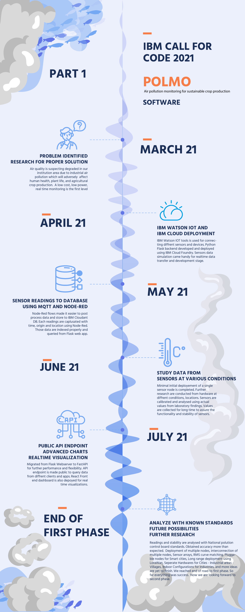
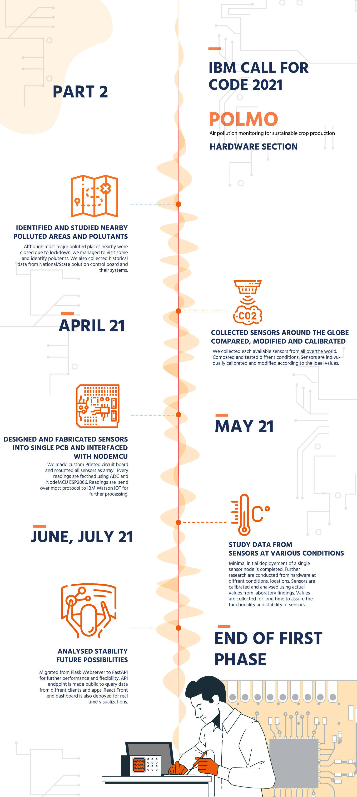

# POLMO - Advanced Air pollution monitoring system

  

A basic GitHub repository example for new [Call for Code](https://developer.ibm.com/callforcode/) projects and those that join the Call for Code with The Linux Foundation deployment initiative. Not all sections or files are required. You can make this as simple or as in-depth as you need. And don't forget to [register for Call for Code 2021](https://developer.ibm.com/callforcode/get-started/)!

## Contents

- [Polmo Project](#polmo-advanced-air-pollution-monitoring-system)
  - [Contents](#contents)
  - [Short description](#short-description)
    - [What's the problem?](#whats-the-problem)
    - [How can technology help?](#how-can-technology-help)
    - [The idea](#the-idea)
  - [Demo video](#demo-video)
  - [The architecture](#the-architecture)
  - [Long description](#long-description)
  - [Project roadmap](#project-roadmap)
  - [Getting started](#getting-started)
  - [Live demo](#live-demo)
  - [Built with](#built-with)
  - [Contributing](#contributing)
  - [Authors](#authors)
  - [License](#license)

## Short description

### What's the problem?

Part of the World Health Organization's guidance on limiting further spread of COVID-19 is to practice social distancing. As a result, schools in most affected areas are taking precautionary measures by closing their facilities. With school-aged children at home for an indeterminate amount of time, keeping them engaged, entertained, and on top of their education is important.

### How can technology help?

Schools and teachers can continue to engage with their students through virtual classrooms, and even create interactive spaces for classes. As parents face a new situation where they may need to homeschool their children, finding appropriate online resources is important as well.

### The idea

It's imperative that learning and creating can continue when educational institutions have to shift the way they teach in times of crises, such as the COVID-19 pandemic. Providing a set of open source tools, backed by IBM Cloud and Watson Services, will enable educators to more easily make content available for their students.

## Demo video

## The architecture

1. The user navigates to the site and uploads a video file.
2. Watson Speech to Text processes the audio and extracts the text.
3. Watson Translation (optionally) can translate the text to the desired language.
4. The app stores the translated text as a document within Object Storage.

## Long description

[More detail is available here](./docs/DESCRIPTION.md)

## Project roadmap

The project currently does the following things.
- Sense Major Pollutants.
- Sent readings seperatly to IBM Watson IOT cloud.
- Display Realtime data at Webendpoint
- Provide API to fetch Realtime and historical data.

See below for our past road map before Call for Code 2021 submission.

## Getting started

In this section you add the instructions to run your project on your local machine for development and testing purposes. You can also add instructions on how to deploy the project in production.

- [Polmo Hardware](./'POLMO Sofware'/)
- [Polmo Software](./'POLMO Hardware'/)

## Live demo

Live demo link will be uploaded very soon.

## Built with

- [IBM Cloudant](https://cloud.ibm.com/catalog?search=cloudant#search_results) - The NoSQL database used
- [IBM Cloud Functions](https://cloud.ibm.com/catalog?search=cloud%20functions#search_results) - The compute platform for handing logic
- [IBM API Connect](https://cloud.ibm.com/catalog?search=api%20connect#search_results) - The FastAPI Web Framework

## Contributing

Please read [CONTRIBUTING.md](CONTRIBUTING.md) for details on our code of conduct, and the process for submitting pull requests to us.

## Authors

- **Harinarayanan P** - [GitHub](https://github.com/HarinarayananP)
- **Amjed Ali K** - [GitHub](https://github.com/amjed-ali-k)

## License

This project is licensed under the Apache 2 License - see the [LICENSE](LICENSE) file for details.

## Acknoledgemnt

We sincerly inform our gratitudes to
- [Sebastián Ramírez] (https://github.com/tiangolo) - For FastAPI framework
- [Creative Tim] (https://www.creative-tim.com/) - For Argon free dashboard template
- [Webkom] (https://github.com/0wczar/airframe-react) - For a beautiful react Dashboard
- [Freepik] (https://free-pik.com) - For design files and templates
- All family, friends, collegues who helped and appreciated us in this journey.
