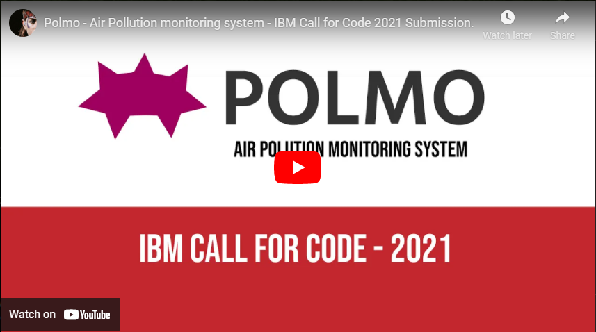
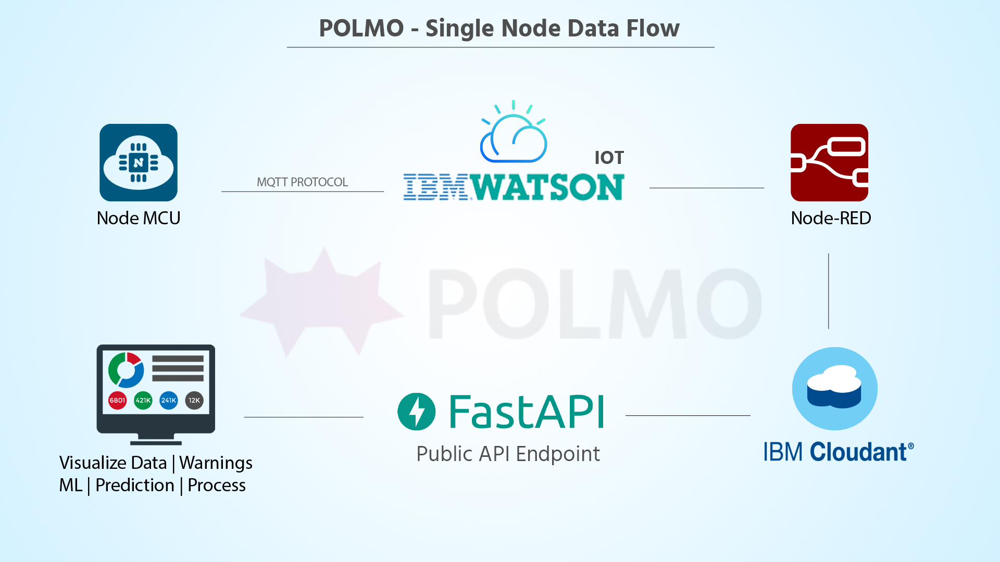
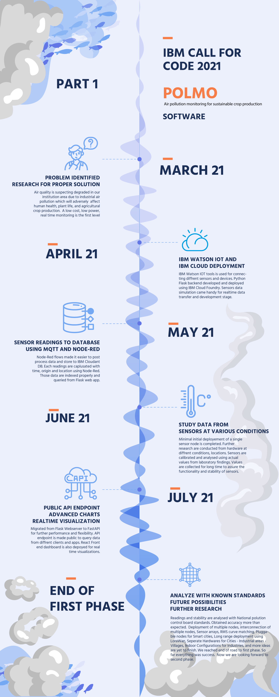
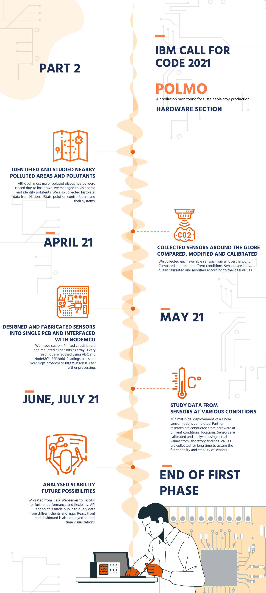

# Polmo - Air Pollution Monitoring System

 
 
 
 

POLMO is a low cost IoT based real time air pollution monitoring system.  It uses advanced sensing technologies to collect information about air pollution from the real world and provides  real time sensor data  visualization, machine learning based air quality prediction, warning information for human beings, animals, and plants due to air pollution.
## Contents

- [Polmo - Air Pollution Monitoring System](#polmo---air-pollution-monitoring-system)
  - [Contents](#contents)
  - [Short description](#short-description)
    - [What's the problem?](#whats-the-problem)
    - [How can technology help?](#how-can-technology-help)
    - [The idea](#the-idea)
  - [Demo video](#demo-video)
  - [The architecture](#the-architecture)
  - [Long description](#long-description)
  - [Project roadmap](#project-roadmap)
  - [Getting started](#getting-started)
  - [Live demo](#live-demo)
  - [Built with](#built-with)
  - [Contributing](#contributing)
  - [Authors](#authors)
  - [License](#license)
  - [Acknoledgement](#acknoledgement)

## Short description

### What's the problem?

Air pollution adversely affects human health, plant life, and agricultural crop production.  Agricultural crops can be injured when exposed to high concentrations of various air pollutants.  In a recent study, researchers have analysed 30 years of data on yields of wheat and rice alongside data on air pollution and climate in India and concluded that significant decreases in yield could be attributed to air pollutants.

### How can technology help?

Regular monitoring and controlling air pollution leads to increased yield from agricultural and livestock products. The warning can be given to farmers using pollution related predictions, precautions can be taken to protect plants, plan for the right cultivation time to get more yield.  There is an increased demand for localized IoT enabled automated air pollution monitoring systems which provide air pollution related information for people through an easy interface.  For realizing such a system gas sensors with advanced sensing technologies, IoT, cloud computing, and machine learning can be Incorporated.

### The idea

Developing and deploying low cost, low power, quicker, and real time air pollution monitoring system at pollution affected area. For this, array sensor nodes are developed by incorporating major air pollutants sensors and NodeMCU.  This embedded system uploads the air pollution data to the IBM Watson IoT cloud over Wi-Fi protocol. 

## Demo video

## The architecture

1. Node Mcu from Polmo sensor node reads the sensor readings. 
2. It will send the readings through MQTT Protocol to IBM Watson IOT
3. Using Node Red Flows the readings are fetched from IBM Watson IOT and Stored it into IBM Cloudant DB
4. A public API Endpoint is made using Fast API, It processes and delivers the contents from Cloudant DB to Apps
5. A React Dashboard is created to visualize realtime data.

## Long description

[More detail is available here](./docs/DESCRIPTION.md)

## Project roadmap

The project currently does the following things.
- Sense Major Pollutants.
- Sent readings seperatly to IBM Watson IOT cloud.
- Display Realtime data at Webendpoint
- Provide API to fetch Realtime and historical data.

See below for our past road map before Call for Code 2021 submission.

## Getting started

In this section you add the instructions to run your project on your local machine for development and testing purposes. You can also add instructions on how to deploy the project in production.

- [Polmo Software](./POLMO%20Sofware/)
- [Polmo Hardware](./POLMO%20Hardware/)

## Live demo

By clicking this [link you](https://polmo-react-app.vercel.app/) can visit the live website. 

## Built with

- [IBM Cloudant](https://cloud.ibm.com/catalog?search=cloudant#search_results) - The NoSQL database used
- [IBM Cloud Functions](https://cloud.ibm.com/catalog?search=cloud%20functions#search_results) - The compute platform for handing logic
- [IBM API Connect](https://cloud.ibm.com/catalog?search=api%20connect#search_results) - The FastAPI Web Framework

## Contributing

Please read [CONTRIBUTING.md](CONTRIBUTING.md) for details on our code of conduct, and the process for submitting pull requests to us.

## Authors

- **Harinarayanan P** - [GitHub](https://github.com/HarinarayananP)
- **Amjed Ali K** - [GitHub](https://github.com/amjed-ali-k)

## License

This project is licensed under the Apache 2 License - see the [LICENSE](LICENSE) file for details.

## Acknoledgement

We sincerly inform our gratitudes to
- [Sebastián Ramírez] (https://github.com/tiangolo) - For FastAPI framework
- [Creative Tim] (https://www.creative-tim.com/) - For Argon free dashboard template
- [Webkom] (https://github.com/0wczar/airframe-react) - For a beautiful react Dashboard
- [Freepik] (https://freepik.com) - For design files and templates
- All family, friends, collegues who helped and appreciated us in this journey.
